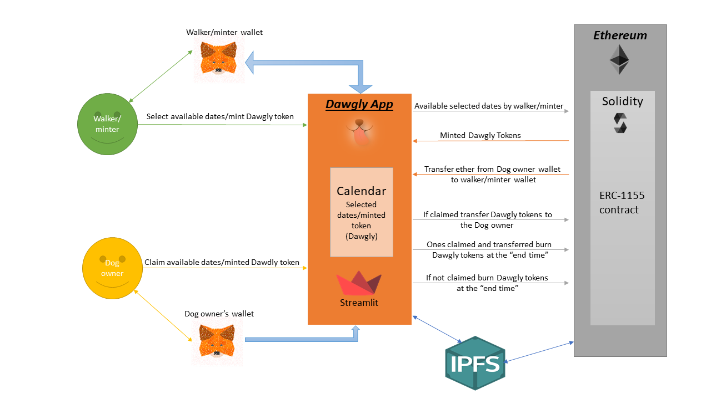

# Dawgly 

*Aa many of us return to semi-normal life following the COVID-19 pandemic, many must resume their dog caring services. Allow us to ease that burden and supply you with an easy-to-use dog walking service. Dawgly is a dog services app that allows doggy parents to connect with our team members. Services include walking, feeding, and taking your loved pup to an appointment.*

## Installations
```python
import os
import json
from web3 import Web3
from pathlib import Path
from dotenv import load_dotenv
import streamlit as st
from hydralit import HydraHeadApp
import datetime 
from datetime import datetime, date, time
```

## Dawgly Logic


## Samples of contract deployment

Below see a sample of the ERC1155 token contract. Compile the completed code/file using the "0.8.0" or higher compiler. 
Once the contracts are successfully compiled make sure you are deploying the contracts in the Injected web3 enviroment.


Once the contract is deployed you will have access the below token contract functonalities that will allow you to burn tokens, mint tokens,tranfers, etc


The minter of the tokens will be the walkers. Each walker can mint tokens that will represent the hours of avilability in which the walkers can take care of a customers pet. The walkers can also assign different values to each our which means they can rate each our depending on complexity of the job. 


 Video showing how to mint tokens.


https://user-images.githubusercontent.com/85713622/144323347-f8acdee6-dd39-45d5-8c2b-862ec4f0216c.mp4


The client can now claim the tokens from the walker of their choice. The screenshot below show the functionality of the contract to transfer tokens from walker to client. 


Sample video showing transfer of tokens from walker to client. 


https://user-images.githubusercontent.com/85713622/144323532-76c7bfa5-ce4f-4e58-adc0-b795d63e6c18.mp4


Within the contract we can now check the balance of tokens each account holds. This also applies if the tokens were given different values. 


Sample video in which we check the balance of the clients wallet with the following toked ID and denomination: ID: 11 value: 1, ID: 12 Value:2

https://user-images.githubusercontent.com/85713622/144322883-df09da65-329d-48e1-8b98-cb0c27746401.mp4

## Samples of Back End

Here we showcase the folders organizatioin  which is very important when deploying the contract/app. 


This is the list of libraries which will need to be loading in order to successfully deploy the full contract/app. 


## Samples of Front End


